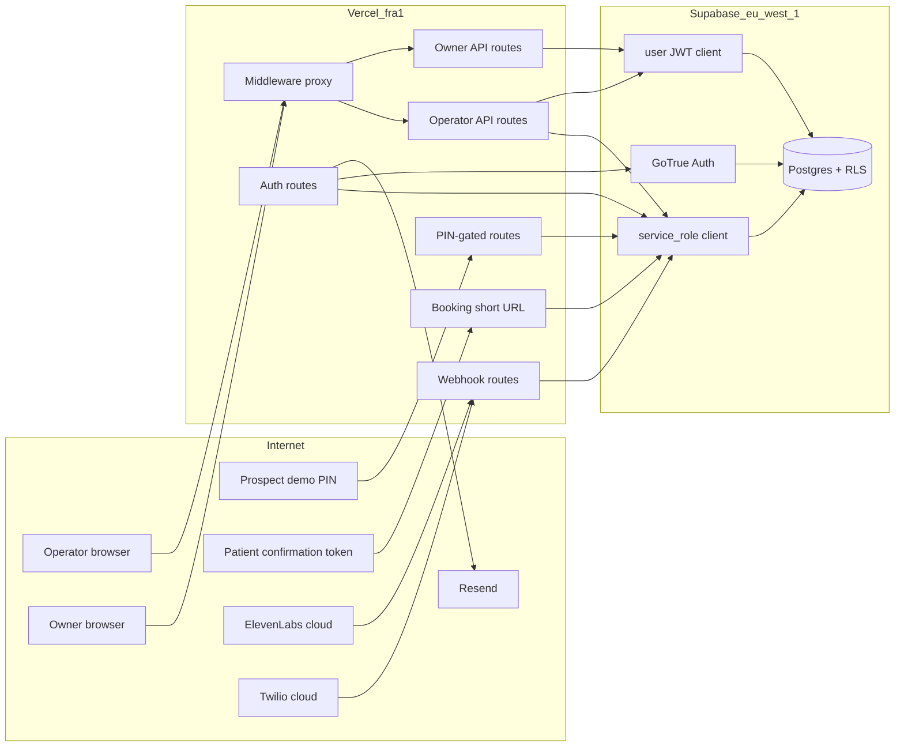

# Threat model — Supabase RLS + auth surface

In-scope: `supabase/migrations/` and the application code that touches Supabase (`apps/web/`, `apps/backend/`). Goal: validate tenant isolation between operator (cross-tenant), tenant_member (own tenant), and prospect (PIN-gated demo) audiences; surface field-level leaks; flag unjustified service-role usage.

Generated 2026-05-23 against branch `main`. Companion to `security_best_practices_report.md` (the 13-finding AppSec audit from earlier today).

## Executive summary

The RLS design is sound at the policy layer. Every privileged table has RLS enabled, operator/tenant_member separation is encoded in well-formed helper functions (`is_operator`, `is_tenant_member`), and the SECURITY DEFINER RPCs (`get_tenant_owners`, `is_active_tenant_member`) correctly REVOKE from `anon`/`authenticated` and GRANT only to `service_role`. The dominant risk surface is **not** the policies themselves, but the **breadth of service-role use in the Next.js layer** (30+ call sites) which means every privilege check must be re-done in TypeScript. Two such checks are already broken (operator detection via user-JWT against `operator_emails`, which has no SELECT policy and silently returns empty for everyone). The other top themes are **weak prospect PIN entropy** (legacy 4-digit PINs may persist + per-IP rate limit is bypassable by IP rotation), **plaintext storage of long-lived auth tokens** (owner sign-in tokens, OTP codes minted via admin API), and **missing rate-limit on the Twilio inbound IVR** ahead of the PSTN turn-up.

## Scope and assumptions

In-scope paths:

- `supabase/migrations/*.sql`
- `apps/web/lib/supabase-server.ts`, `apps/web/lib/supabase-browser.ts`, `apps/web/lib/owner-agent-context.ts`, `apps/web/lib/auth-materialize-invitations.ts`, `apps/web/lib/booking-deps.ts`, `apps/web/lib/rate-limit.ts`, `apps/web/lib/verify-webhook-signature.ts`, `apps/web/lib/verify-twilio-signature.ts`
- `apps/web/proxy.ts` (middleware)
- `apps/web/app/api/**` and `apps/web/app/{auth,b,demo,owner,dashboard,test}/**` routes that touch Supabase
- `apps/backend/src/post-call/supabase-repository.ts`, `apps/backend/src/tools/supabase-repository.ts`, `apps/backend/src/conversations/list-handler.ts`

Out of scope:

- ElevenLabs / Twilio / Firecrawl / Gemini external surfaces (auth and signing covered in `security_best_practices_report.md`)
- CSP / sourcemap / WAF hardening (deferred per handover §3-4)
- Non-Supabase backfill scripts and seed scripts (`apps/backend/scripts/*`) beyond noting their privilege model
- `pnpm audit` CVE follow-up (handover §2)

Explicit assumptions, baked into severities below:

- Production deploy is Vercel `fra1` + Supabase `eu-west-1`. Pre-pilot scale: <50 concurrent users, no paying clients today; pilot 1 ships in days.
- **Legacy 4-digit `agents.pin_code` rows may still exist in prod** (user said "assume worst case"). New PIN issuance is 6-digit.
- **Twilio inbound PSTN is currently NOT wired** ("we still didn't wire the phone number to sip"). The route exists and is feature-flagged off (`TWILIO_INBOUND_ENABLED`). Threat ranking for IVR brute force is "deferred risk", will become live the day the flag is flipped.
- **`OPERATOR_CODE_REM` / `OPERATOR_CODE_SEBASTIAN` static-code login is still in use** for Rem and Sebastian while Resend custom domain is unverified.
- The `service_role` key is currently scoped to one project (`isctdelatfyrzcpynkuq.supabase.co`) and lives only in `apps/web/.env.local` (local) and Vercel project env (prod). It is NOT exposed to the browser (no `NEXT_PUBLIC_` prefix, validated by `lib/env.ts`).
- Operator population is currently 3 emails (Yauheni, Sebastian, Rem) per the seed in `20260520150000_outreach_status_and_operators.sql`. Adding an operator requires a deploy-time seed update.

Open questions that would change the ranking:

- Are any 4-digit PINs still live? A 10-second `select count(*) from agents where length(pin_code)=4 and pin_code is not null` would close the question and let me downgrade TM-001 if zero.
- Is Resend domain verification on the critical path before Demo Day? If yes, the static operator-code route can be removed entirely; if not, TM-005 stays live.
- Are there any prod tenants where `tenant_invitations.signin_token_expires_at` is more than 7 days into the future? Those are the at-risk plaintext tokens in TM-006.

## System model

### Primary components

- **Next.js App Router** (`apps/web/`, Node 24 runtime, deployed to Vercel `fra1`). Hosts API routes, server components, auth callbacks, and the operator/owner/prospect web UIs.
- **`@supabase/ssr` middleware** (`apps/web/proxy.ts`) — refreshes operator session cookies on every gated page hit; enforces CSRF Origin check on `/api/*` state-changing methods (with HMAC bypass for webhook prefixes); does **not** run on `/api/*` other than the Origin check (each route does its own auth).
- **Supabase Postgres** (Ireland `eu-west-1`) — single source of truth for tenants, agents, bookings, transcripts, consent log, conversations, operator/owner identity. RLS enabled on all 12 application tables.
- **Supabase Auth (GoTrue)** — magic-link / OTP / `admin.generateLink` flows. Drives session cookies on the Next.js domain.
- **Backend orchestration** (`apps/backend/src/*`) — pure handlers (`handlePostCall`, `handleCreateBooking`, `handleListConversations`, `handleListOwners`) invoked from the Next.js routes. They expect a `SupabaseClient` injected by the route, which determines the privilege boundary.
- **ElevenLabs ConvAI** (external) — calls our `/api/post-call`, `/api/tools/create-booking`, `/api/tools/check-availability` webhooks signed with `ELEVENLABS_WEBHOOK_SECRET`.
- **Twilio / Zadarma** (external, currently dormant) — calls `/api/twilio/inbound` signed with `TWILIO_AUTH_TOKEN`.
- **Resend** (external) — outbound OTP email; not a Supabase trust boundary.

### Data flows and trust boundaries

- **Internet → Next.js (operator browser)** → operator session JWT in HttpOnly cookie. Boundary enforcement: `proxy.ts` operator gate on `/{provision,test,dashboard}/*`, then `requireOperator()` / `getOperatorOrJsonError()` re-check inside each route. Data crossing: operator action requests (provision, KB edit, PIN rotate, owner invite, conversation drilldown). Channel: HTTPS, cookies `SameSite=Lax`.
- **Internet → Next.js (owner browser)** → tenant-scoped user JWT. Boundary: `proxy.ts` general auth gate, then `resolveOwnerAgent()` reads `tenant_members` via user JWT, so RLS scopes to own tenant. Data crossing: owner-self conversations, KB edits scoped to own tenant.
- **Internet → Next.js (anonymous prospect)** → PIN credential in query string. Boundary: route-level PIN check via service-role read of `agents.pin_code`, then `handleListConversations` forces `source='pin_demo'` and `provider_agent_id=<requested>`. Channel: HTTPS, no cookies. F2 rate-limit (5/min per `agent:IP`).
- **Internet → Next.js (anonymous patient with confirmation token)** → 8-char alphanumeric short-token in URL. Boundary: format regex + DB lookup via service-role on `bookings.short_token`. Data crossing: clinic name, visit time, contact phone (per-booking only). No write access.
- **ElevenLabs cloud → Next.js webhooks** (`/api/post-call`, `/api/tools/*`) → HMAC-SHA256 over `t.<body>` keyed by `ELEVENLABS_WEBHOOK_SECRET`, 5-min replay window. F8 Origin check is bypassed for these prefixes because the HMAC is the auth.
- **Twilio cloud → Next.js webhook** (`/api/twilio/inbound`) → HMAC-SHA1 base64 signature over `url + sorted(form_params)` keyed by `TWILIO_AUTH_TOKEN`. Feature-flagged off (`TWILIO_INBOUND_ENABLED`).
- **Next.js → Supabase** — two clients: `getServiceRoleSupabase()` (RLS-bypassing, `SUPABASE_SERVICE_ROLE_KEY`) for webhook contexts + privileged operator/owner-invite flows; `getUserSupabase()` (anon key + user cookie JWT) for end-user reads where RLS should fire. Backend handlers receive the chosen client by injection; backend never picks.
- **Auth.users insert (Supabase) → operators upsert** — `AFTER INSERT ON auth.users` trigger `promote_operator_on_signup` (SECURITY DEFINER) auto-promotes a user whose email is in `operator_emails`. Cross-table privilege escalation gated by the operator-email allow-list.
- **Operator browser → `/auth/owner-link?token=...`** — 14-day single-use plaintext UUID in DB, service-role lookup, marked consumed, then 302 to a freshly-minted 1h Supabase action_link.

#### Diagram

## Assets and security objectives

| Asset                                                    | Why it matters                                                                                                                                                          | Security objective (C/I/A) |
| -------------------------------------------------------- | ----------------------------------------------------------------------------------------------------------------------------------------------------------------------- | -------------------------- |
| `bookings.patient_name`, `patient_phone`                 | PII (RODO), patient identity. Leak is a compliance incident under Polish data-protection law.                                                                           | C                          |
| `transcripts.turns` (PSTN, consent=true only)            | Full call transcript with patient PII (often more sensitive than the booking row).                                                                                      | C, I                       |
| `consent_log.consent_flag`                               | Audit trail; integrity is the legal defense if transcript storage is challenged. The DB trigger `enforce_consent_for_transcript` depends on this row being unforgeable. | I                          |
| `tenant_invitations.signin_token`                        | 14-day bearer credential for owner sign-in. Plaintext in DB. Service-role read = mass account-takeover.                                                                 | C                          |
| `agents.pin_code`                                        | Bearer credential for the public `/demo/[agentId]` and `/api/conversations?pin=` paths. Per-agent, unique.                                                              | C                          |
| `operators` / `operator_emails` membership               | Grants cross-tenant SELECT/UPDATE/INSERT/DELETE via RLS bypass. Promotion is automatic on `auth.users` insert if email matches.                                         | I                          |
| `service_role` key                                       | Single secret, RLS bypass for the entire database. Leak = full data exfiltration + write.                                                                               | C                          |
| `bookings.short_token`                                   | 8-char URL-safe token for `/b/[token]` confirmation page. Reveals patient appointment time.                                                                             | C                          |
| `OPERATOR_CODE_REM` / `OPERATOR_CODE_SEBASTIAN` env vars | Permanent bearer credentials mapped to specific operator emails. No rotation, no expiry.                                                                                | C                          |
| `ELEVENLABS_WEBHOOK_SECRET`, `TWILIO_AUTH_TOKEN`         | HMAC secrets. Forgery of either = consent flag manipulation, fake bookings, IVR hijack.                                                                                 | C                          |
| Polish dental ontology + curated KB markdown             | Authored IP. Confidentiality is commercial, not regulatory.                                                                                                             | C                          |
| `sms_send_failures.to_phone`                             | PII in observability table.                                                                                                                                             | C                          |

## Attacker model

### Capabilities

- **Unauthenticated internet attacker**: can hit any `/api/*` route, any public page (`/demo/*`, `/b/*`, `/test/*`, `/auth/*`). Can rotate source IPs cheaply (residential proxy). Can buy any PSTN number once Twilio is wired. Has access to public scrape of any clinic's URL (the wedge entry point) — but cannot forge HMAC signatures without the webhook secret.
- **Authenticated tenant_member (clinic owner)**: has valid Supabase session, RLS-scoped to own tenant. Can call `/owner/*` routes, can read all conversations / bookings / consent_log / transcripts / agents / SVM for own tenant. Can edit `tenants.sms_confirmations_enabled` and KB.
- **Authenticated operator**: cross-tenant SELECT/INSERT/UPDATE/DELETE on most tables via RLS. Can invite owners, rotate PINs, mint signin tokens, delete agents, change outreach status, import phone numbers. Three trusted operators today.
- **Prospect with a PIN** (`/demo/[agentId]?pin=`): can speak with the demo agent and read prior `pin_demo` conversations for that one agent.
- **Patient with a confirmation token** (`/b/[token]`): can see one booking's time + clinic name + contact phone.
- **Compromised ElevenLabs cloud egress**: could replay or forge webhooks if `ELEVENLABS_WEBHOOK_SECRET` leaks. (Out of scope unless we leak the key.)

### Non-capabilities

- Cannot read `service_role` key directly — not exposed to browser, validated by `lib/env.ts`, no `NEXT_PUBLIC_` prefix.
- Cannot read `operator_emails` via PostgREST (no SELECT policy, RLS denies all non-service-role).
- Cannot write `transcripts` for a conversation lacking a `consent_log` row with `consent_flag=true` — DB trigger `enforce_consent_for_transcript` blocks defense-in-depth.
- Cannot insert `tenants` or `agents` rows via end-user JWT — INSERT policies require `is_operator(auth.uid())`.
- Cannot self-promote to operator — requires `auth.users.email` to be in `operator_emails`, which is only writable via service-role (deploy seed).
- Cannot read other tenants' data via owner JWT — RLS uses `is_tenant_member(tenant_id)` on every privileged table.
- Cannot bypass the F8 Origin check on `POST /api/*` from a third-party domain (unless the route is on the webhook bypass list, in which case HMAC takes over).
- Cannot run JS that calls `getServiceRoleSupabase()` from the browser — it's a server-only export, would fail to compile if imported into a `"use client"` file.

## Entry points and attack surfaces

| Surface                                                      | How reached                                           | Trust boundary                                                                                                   | Notes                                                                                                                             | Evidence                                                                                      |
| ------------------------------------------------------------ | ----------------------------------------------------- | ---------------------------------------------------------------------------------------------------------------- | --------------------------------------------------------------------------------------------------------------------------------- | --------------------------------------------------------------------------------------------- |
| `/api/post-call`                                             | ElevenLabs cloud POST                                 | Internet → service-role write of `consent_log`, `transcripts`, `conversations`, `bookings.recovered_revenue_pln` | HMAC required in prod (F9 hard-fails if `ELEVENLABS_WEBHOOK_SECRET` missing when `VERCEL_ENV=production`).                        | `apps/web/app/api/post-call/route.ts:13-22`, `apps/web/lib/verify-webhook-signature.ts:57-66` |
| `/api/tools/create-booking`, `/api/tools/check-availability` | ElevenLabs cloud POST                                 | Internet → service-role booking write                                                                            | Same HMAC verifier. Tenant resolved by `agents.provider_agent_id`.                                                                | `apps/web/app/api/tools/create-booking/route.ts:9-31`                                         |
| `/api/twilio/inbound`                                        | Twilio/Zadarma POST (currently dormant)               | Internet → service-role read `agents.pin_code` by PIN value                                                      | F4 X-Twilio-Signature HMAC-SHA1. **No rate limit on this route.**                                                                 | `apps/web/app/api/twilio/inbound/route.ts:31-72`                                              |
| `/demo/[agentId]?pin=` (server component)                    | Anyone                                                | Internet → service-role read `agents.pin_code` for compare                                                       | 5/min per agent+IP rate limit lives on `/api/conversations`, NOT on the page itself.                                              | `apps/web/app/demo/[agentId]/page.tsx:15-37`                                                  |
| `/api/conversations?pin=&agentId=` GET                       | Anyone                                                | Internet → service-role read `conversations` filtered to `source='pin_demo'`                                     | F2 rate-limit before PIN compare. Plain `!==` compare (not timing-safe; acceptable given rate-limit).                             | `apps/web/app/api/conversations/route.ts:42-75`                                               |
| `/api/conversations/[conversationId]?pin=&agentId=` GET      | Anyone                                                | Internet → service-role read one row                                                                             | Forces `source=pin_demo` + agent match. Synthesizes transcript from `test_transcripts` if missing.                                | `apps/web/app/api/conversations/[conversationId]/route.ts:33-69`                              |
| `/api/test-transcript` POST                                  | Anyone (with PIN or operator session)                 | Internet → service-role insert into `test_transcripts`                                                           | F3 rate-limit (60/min per agent+conv+IP). PIN check via service-role, operator check via service-role (correct).                  | `apps/web/app/api/test-transcript/route.ts:51-108`                                            |
| `/api/conversations/finalize` POST                           | Anyone (operator or PIN)                              | Internet → service-role write `conversations`                                                                    | **`isOperator` computed via user-JWT against `operator_emails` (BUG — always false; downgrades operators to PIN-only finalize).** | `apps/web/app/api/conversations/finalize/route.ts:38-48`                                      |
| `/api/conversations` GET (auth path)                         | Authenticated user                                    | User-JWT or operator path                                                                                        | **Same operator_emails-via-user-JWT bug as finalize.** Owner path takes first `tenant_members` row only (`.limit(1)`).            | `apps/web/app/api/conversations/route.ts:78-103`                                              |
| `/api/agents/[providerAgentId]/pin` GET / POST               | Operator session                                      | Internet → service-role read/write `agents.pin_code`                                                             | Operator gate via `getOperatorOrJsonError()`. 6-digit `crypto.randomInt` generation.                                              | `apps/web/app/api/agents/[providerAgentId]/pin/route.ts:22-89`                                |
| `/api/agents/[providerAgentId]/owner-invite` POST            | Operator session                                      | Internet → service-role upsert `tenant_invitations`                                                              | Operator gate via service-role on `operator_emails` (correct), rejects invitee whose email is itself an operator.                 | `apps/web/app/api/agents/[providerAgentId]/owner-invite/route.ts:40-86`                       |
| `/api/agents/[providerAgentId]/owner-signin-link` POST       | Operator session                                      | Internet → service-role upsert `tenant_invitations.signin_token`                                                 | Mints opaque UUIDv4, 14-day TTL, single-use. **Stored plaintext.**                                                                | `apps/web/app/api/agents/[providerAgentId]/owner-signin-link/route.ts:53-133`                 |
| `/auth/owner-link?token=` GET                                | Anyone with the token                                 | Internet → service-role read+mark-consumed `tenant_invitations` then 302 to fresh action_link                    | **Consumed-update is not atomic with the read; two parallel clicks both mint a fresh action_link.**                               | `apps/web/app/auth/owner-link/route.ts:20-87`                                                 |
| `/auth/callback?code=&next=` GET                             | Anyone with a valid Supabase code                     | Internet → user JWT minted + service-role materialize invitations                                                | Open-redirect guard on `next`. Materialization of any pending invite for the matched email.                                       | `apps/web/app/auth/callback/route.ts:33-107`                                                  |
| `/api/auth/request-magic-link` POST                          | Anyone                                                | Internet → service-role `admin.generateLink` + Resend send                                                       | F5 rate-limit (3/h per email, 10/h per IP). Allow-list: `operator_emails` ∪ pending invitation ∪ active tenant_member.            | `apps/web/app/api/auth/request-magic-link/route.ts:43-176`                                    |
| `/api/auth/verify-otp` POST                                  | Anyone                                                | Internet → mint Supabase session via cookieSink                                                                  | F5 rate-limit (5 / 10min per email+IP). Same triple allow-list. Defense-in-depth whitelist re-check.                              | `apps/web/app/api/auth/verify-otp/route.ts:47-211`                                            |
| `/api/auth/operator-code-redeem` POST                        | Anyone                                                | Internet → service-role `admin.generateLink` + cookieSink session                                                | **Plain `===` compare to env var; permanent code; per-IP rate limit only (not per-code).**                                        | `apps/web/app/api/auth/operator-code-redeem/route.ts:39-152`                                  |
| `/b/[token]` page + `/b/[token]/calendar.ics`                | Anyone with the token                                 | Internet → service-role read `bookings + tenants`                                                                | 8-char alphanumeric (~36^8 entropy). No rate limit.                                                                               | `apps/web/app/b/[token]/page.tsx:11-22`, `apps/web/app/b/[token]/calendar.ics/route.ts:9-17`  |
| `/dashboard/*` server components                             | Operator session via middleware + `requireOperator()` | Browser → user-JWT Supabase (operator RLS bypass via policies)                                                   | RLS does the per-row gate; `requireOperator` is surface-level.                                                                    | `apps/web/app/dashboard/page.tsx:36`, `apps/web/lib/supabase-server.ts:94-118`                |
| `/owner/*` server components                                 | Owner session via middleware + `resolveOwnerAgent()`  | Browser → user-JWT Supabase (tenant_member RLS)                                                                  | Picks first `tenant_members` row arbitrarily for owners of >1 tenant.                                                             | `apps/web/lib/owner-agent-context.ts:20-50`                                                   |

## Top abuse paths

1. **Prospect PIN brute force on legacy 4-digit agents** → attacker grabs `?agentId=agent_xyz` from any operator-shared demo URL → cycles through 0000–9999 against `/api/conversations?pin=...&agentId=...` from a rotating residential-IP pool → rate-limit key is `pin:<agent>:<ip>` so per-IP rotation defeats it → first match yields full prospect-mode read on that agent's `pin_demo` conversations (patient phrasing, demo transcript). **Impact**: PII disclosure for any prospect who exercised the demo with that PIN, plus access to write `test_transcripts` and exercise voice/chat at our expense. **Severity: high while legacy PINs exist; medium otherwise.**

2. **Operator-code static spray** → attacker grabs the canonical `/api/auth/operator-code-redeem` route shape from any leaked source path, sprays 8-character codes against it from 100 IPs in parallel → per-IP rate limit (5/min) does not cap the spray globally → first match yields a fresh Supabase operator session for Rem or Sebastian → full cross-tenant RLS bypass on all conversations/transcripts/bookings/PINs, ability to mint new owner sign-in links for any tenant. **Severity: high**, mitigated only by namespace size (8+ chars of attacker-chosen entropy if codes were chosen well).

3. **Twilio IVR PSTN brute force** (latent, becomes live when `TWILIO_INBOUND_ENABLED=1`) → attacker calls the assigned +48 number repeatedly, gathers 4-digit PINs against `agents.pin_code` (global namespace, not per-tenant) → no rate limit on the route → first match triggers `<Dial><Sip>` to that agent's SIP endpoint = caller can drive any clinic's voice agent at attacker's expense (toll fraud + impersonation of clinic infrastructure). **Severity: high once enabled; deferred today.**

4. **Service-role compromise via env-var leak** (e.g. accidental Vercel project ENV dump in support thread, Vercel Toolbar misuse, MCP write surface) → attacker has `SUPABASE_SERVICE_ROLE_KEY` → connects directly to PostgREST → reads all transcripts, all PII, all PINs in plaintext, all `tenant_invitations.signin_token`s for the next 14 days, writes/deletes anything → complete tenant breach. **Severity: critical, low likelihood**; the compensating control is operational hygiene only (no token rotation, no key-scope).

5. **`/api/conversations/finalize` operator path silently broken** → operator clicks "finalize" on a browser_test session → route does `userSupabase.from("operator_emails")` which RLS denies → `isOperator=false` → handler refuses browser_test finalization → operator sees an opaque error. **Severity: low (availability/UX, not confidentiality)**; not exploitable but indicates the wider class of "wrong-client privilege check" bugs.

6. **Owner sign-in-token harvest via single point of failure** → attacker who has read access to `tenant_invitations` (service-role compromise OR a future bug exposing the table) reads every unused `signin_token` (plaintext, 14-day TTL) → uses each token at `/auth/owner-link?token=` → mints fresh action_link → mints owner session for every pending invitee. **Severity: high, low likelihood** today; the right hardening is to hash the token at rest (`sha256(token)` stored, comparison via constant-time hash).

7. **Multi-tenant owner blinded to N-1 tenants** → owner who owns 2+ clinics signs in → `resolveOwnerAgent()` and `/api/conversations` owner path both do `.limit(1).maybeSingle()` on `tenant_members` → owner only ever sees the arbitrarily-picked first tenant. **Severity: low (correctness/UX)**, no escalation; flag for fix before any clinic group goes live.

8. **Email-handover invitation hijack** → operator invites `owner@example.com` → owner@example.com mailbox is later abandoned and the domain expires → attacker registers the domain, receives email → goes through `/api/auth/request-magic-link` → wins membership on first sign-in via `materializePendingInvitations`. **Severity: low**, mitigated by the 14-day signin_token TTL but the materialization itself has no TTL on the invitation row. Same risk for invitations sent and never consumed.

9. **Per-IP rate-limiter bypass via IP rotation** → any route that limits on `<bucket>:<ip>` (PIN check, OTP verify, operator-code redeem, owner magic-link request) is defeated by an attacker with N residential IPs → effective rate budget scales linearly with attacker IPs → cap is the in-memory `MAX_KEYS = 10_000` bucket count before LRU prune. **Severity: medium** — already documented in `lib/rate-limit.ts` as a known trade-off pending swap to a Supabase-backed counter.

10. **Webhook signature verifier dev fallback** → if an attacker somehow flips `NODE_ENV` and `VERCEL_ENV` away from `"production"` (e.g. via a Vercel project misconfiguration during an emergency redeploy), verifier silently accepts unsigned webhooks → forged `/api/post-call` calls can write `consent_flag=true` for any `conversation_id` and overwrite booking revenue. **Severity: low**, F9 is documented as the dual-env safeguard; the risk surface is operator misconfiguration during incident response.

## Threat model table

| Threat ID | Threat source                                                                            | Prerequisites                                                                                                           | Threat action                                                                                                                                                                 | Impact                                                                                            | Impacted assets                                                                               | Existing controls (evidence)                                                                                                                                                                                                                                                          | Gaps                                                                                                                                                                     | Recommended mitigations                                                                                                                                                                                                                                                                                         | Detection ideas                                                                                                                                     | Likelihood                                    | Impact severity | Priority                           |
| --------- | ---------------------------------------------------------------------------------------- | ----------------------------------------------------------------------------------------------------------------------- | ----------------------------------------------------------------------------------------------------------------------------------------------------------------------------- | ------------------------------------------------------------------------------------------------- | --------------------------------------------------------------------------------------------- | ------------------------------------------------------------------------------------------------------------------------------------------------------------------------------------------------------------------------------------------------------------------------------------- | ------------------------------------------------------------------------------------------------------------------------------------------------------------------------ | --------------------------------------------------------------------------------------------------------------------------------------------------------------------------------------------------------------------------------------------------------------------------------------------------------------- | --------------------------------------------------------------------------------------------------------------------------------------------------- | --------------------------------------------- | --------------- | ---------------------------------- |
| TM-001    | Unauthenticated internet                                                                 | Knows a `provider_agent_id` (publicly shared in operator-distributed demo URLs); legacy 4-digit PIN exists              | Brute-force PIN against `/api/conversations?pin=&agentId=` from rotating IPs; consume prospect PII once matched                                                               | PII disclosure on prospect demos for that agent; chargeable LLM/voice minutes consumed            | `agents.pin_code`, `test_transcripts.text`, `conversations.raw_jsonb`                         | F2 rate-limit 5/min per `agent:IP` (`apps/web/lib/rate-limit.ts:1-101`); 6-digit `crypto.randomInt` for new PINs (`apps/web/app/api/agents/[providerAgentId]/pin/route.ts:22-24`); RLS forces `source='pin_demo'` in handler (`apps/backend/src/conversations/list-handler.ts:41-43`) | Rate-limit key includes IP → IP rotation defeats it; 4-digit legacy PINs not yet rotated; no global per-agent cap                                                        | Force-rotate every PIN to 6 digits today (`scripts/rotate-pins.ts` exists, run it); add a per-agent cap independent of IP (e.g. 50/h regardless of source); switch in-memory limiter to Supabase-backed counter                                                                                                 | Alert on bucket overflow events; weekly query `select id from agents where length(pin_code) < 6`; Vercel WAF rule on PIN-path 403 rate per IP block | high                                          | high            | high                               |
| TM-002    | Unauthenticated internet                                                                 | None                                                                                                                    | Distributed spray against `/api/auth/operator-code-redeem` from N IPs                                                                                                         | Operator session mint for Rem/Sebastian → full cross-tenant RLS bypass                            | All `operators`-scoped tables, sign-in tokens, PIN reset                                      | F5 per-IP 5/min rate limit (`apps/web/app/api/auth/operator-code-redeem/route.ts:52-62`); 8-char min length enforced by zod; codes mapped 1:1 in source so only 2 are valid at a time                                                                                                 | No per-code rate limit; permanent codes with no expiry; non-constant-time `===` compare; no MFA on session mint                                                          | Add per-`code` rate limit (e.g. `auth:operator-code:${code}` bucket) so total attempts across all IPs are capped; switch to `crypto.timingSafeEqual` over hex-encoded codes; set a hard expiry on the env var (e.g. 7 days, rotate weekly); **delete the route entirely once Resend custom domain is verified** | Slack/email alert on every 401 from this route; alert on success from a country other than PL on first-use                                          | medium                                        | critical        | high                               |
| TM-003    | Unauthenticated PSTN caller                                                              | `TWILIO_INBOUND_ENABLED=1` (currently off)                                                                              | Repeated calls to assigned +48 number, brute force 4-digit DTMF PIN                                                                                                           | Toll fraud (SIP-bridged to ElevenLabs at our expense); impersonation of any clinic                | `agents.pin_code`, ElevenLabs minutes                                                         | F4 X-Twilio-Signature HMAC (`apps/web/lib/verify-twilio-signature.ts:37-76`); 4-digit input range; agent lookup by global unique PIN                                                                                                                                                  | No application-layer rate limit on this route; per-call cost on us; signal of brute force is invisible in Twilio dashboard alone                                         | Before flipping `TWILIO_INBOUND_ENABLED`: add a per-`From`-number rate limit (e.g. 5 invalid PINs / 10 min) and consume from a Supabase-backed counter; require 6-digit PINs in `<Gather numDigits="6">`; set Twilio's Voice Insights / fraud alerts; cap concurrent SIP bridges per agent                      | Twilio call-volume alert; Supabase query of `agents` reads-by-PIN with no match                                                                     | medium                                        | high            | high (becomes critical on go-live) |
| TM-004    | Service-role key compromise (operator workstation, Vercel ENV leak, MCP misuse)          | Attacker obtains `SUPABASE_SERVICE_ROLE_KEY`                                                                            | Direct PostgREST or `psql` access; read/write everything                                                                                                                      | Full tenant breach: all PII, transcripts, PINs, sign-in tokens, ability to insert/delete anything | All Supabase tables                                                                           | Server-only export (`apps/web/lib/supabase-server.ts:24-35`); env validated by zod (`apps/web/lib/env.ts:36-38`); no `NEXT_PUBLIC_` prefix; gitignored `.env.local`; broken-glass detection none today                                                                                | No key rotation cadence; one key for entire prod surface; no scoped RLS-enforcing secondary key; key in `apps/web/.env.local` on operator laptops                        | Quarterly key rotation; restrict key to a backend-only Vercel env scope; consider scoped Supabase API keys (issued per integration) once they GA; add a Postgres audit trigger on writes to sensitive tables emitting to Supabase logs                                                                          | Supabase log aggregator alert on service-role from new IP / new ASN; weekly diff of Vercel ENV access logs                                          | low                                           | critical        | high                               |
| TM-005    | Authenticated operator session (compromised or insider)                                  | Stolen session cookie or insider acting outside lane                                                                    | Bulk export of every clinic's conversations + transcripts via `/api/conversations` operator path or dashboard analytics page; mint sign-in tokens for arbitrary tenant owners | PII bulk exfiltration; lateral compromise of every owner account                                  | `transcripts.turns`, `bookings.patient_phone`, `tenant_invitations.signin_token`              | Operator allow-list (`operator_emails`); `requireOperator()` + `getOperatorOrJsonError()` re-check on every route; operator population = 3 today                                                                                                                                      | No per-action audit log; no rate limit on operator routes; no anomaly detection; operator sessions don't require periodic re-auth                                        | Add an `operator_actions` audit table (operator_id, action, target, ip, ts); rate-limit `/api/agents/.../owner-signin-link` per operator (e.g. 20/day) and `/api/agents/.../pin` POST (50/day); shorten Supabase session TTL for operator-classed users                                                         | Slack alert on `owner-signin-link` issuance > N/hour; alert on cross-tenant fetches > N/hour per operator                                           | low                                           | high            | medium                             |
| TM-006    | Read access to `tenant_invitations` (service-role compromise or future RLS gap)          | TM-004 OR a bug exposing the table                                                                                      | Read every unused `signin_token` plaintext, replay each to `/auth/owner-link?token=`                                                                                          | Owner-session mint for every pending invitee in the 14-day window                                 | `tenant_invitations.signin_token`, owner tenant data                                          | UUIDv4 entropy (122 bits); 14-day TTL; single-use; the table has only an operator SELECT policy via RLS; revocation via operator delete on `/api/agents/.../owners` DELETE                                                                                                            | **Token stored plaintext**; consumed-update on `/auth/owner-link` is not atomic with the read (parallel clicks both mint links); no per-tenant cap on outstanding tokens | Store `sha256(token)` instead of token; compare via constant-time hash; change the consumed-update to `update ... where signin_token = $1 and signin_token_consumed_at is null returning *` and only proceed if a row was returned; cap outstanding tokens per tenant (e.g. 3)                                  | Daily query of count of unused `signin_token`s per tenant; alert if > 3; alert on `/auth/owner-link` 410 rate (already-used clicks)                 | low                                           | high            | medium                             |
| TM-007    | Authenticated owner (clinic)                                                             | Owner is a member of 2+ tenants                                                                                         | UX defect: `/api/conversations` owner path and `resolveOwnerAgent()` pick the first `tenant_members` row arbitrarily                                                          | Owner sees only one of N owned tenants' data; not a leak, an under-disclosure                     | Availability of own data                                                                      | RLS still scopes to `is_tenant_member(tenant_id)` (`supabase/migrations/20260516120000_init.sql:252-269`); no cross-tenant leak risk                                                                                                                                                  | `.limit(1).maybeSingle()` instead of returning the full membership set or accepting a `?tenantId=` selector                                                              | Add a `?tenantId=` selector to owner routes; in middleware, set a `selected_tenant` cookie scoped to the user's memberships; resolveOwnerAgent should return all memberships, route picks one                                                                                                                   | Server-side log when owner has > 1 tenant_members row and route picks the first                                                                     | medium (whenever a multi-tenant owner exists) | low             | medium                             |
| TM-008    | Attacker who controls a former invitee's email mailbox (domain expiry, account takeover) | Operator invited a now-stale email; invitation never consumed; signin_token expired or new request-magic-link flow used | New mailbox owner requests OTP, materialize-pending-invitations grants tenant_members                                                                                         | Tenant takeover for that clinic                                                                   | Tenant data, future conversations                                                             | F5 rate-limit on magic-link request; allow-list includes pending invitation OR active membership; invitation rows persist indefinitely                                                                                                                                                | No expiry on `tenant_invitations` rows themselves (only on `signin_token`); materialization is automatic on first sign-in regardless of invitation age                   | Add an `invited_at + 30d` materialization expiry (refuse to consume invitations older than 30 days); add operator-facing "pending invitations > 30d" cleanup view; periodically auto-consume stale invitations                                                                                                  | Weekly query of pending invitations older than 30 days; alert on materialization where `invited_at < now() - 30 days`                               | low                                           | high            | medium                             |
| TM-009    | Unauthenticated internet                                                                 | Knows a route handler that does an in-memory rate-limited check                                                         | Spray from N IPs; cap is per-IP not per-credential                                                                                                                            | Brute force on PIN, OTP, operator code, magic-link request                                        | All bearer credentials in tables 1-3 of this row                                              | Documented trade-off in `apps/web/lib/rate-limit.ts:1-15`; `MAX_KEYS=10_000` LRU prune; per-instance buckets                                                                                                                                                                          | Per-instance + per-IP keys allow N-instance × N-IP effective budget; cleared on cold start                                                                               | Switch to Supabase-backed counter (`rate_limit_attempts(key,attempted_at)`); add a per-credential bucket alongside per-IP; consider Vercel WAF rate-limit rules at the edge                                                                                                                                     | Alert on `MAX_KEYS` overflow / prune events; alert on per-route 429 rate                                                                            | high (any credential surface)                 | medium          | medium                             |
| TM-010    | Misconfigured environment (operator action during incident)                              | `NODE_ENV` and `VERCEL_ENV` both set away from `"production"` on a prod deploy                                          | Webhook verifier silently accepts unsigned bodies                                                                                                                             | Forged `consent_flag=true` writes, fake bookings, recovered-revenue manipulation                  | `consent_log`, `transcripts`, `bookings.recovered_revenue_pln`                                | F9 dual-env check (`apps/web/lib/verify-webhook-signature.ts:53-66`); env validator hard-fails on missing prod secret                                                                                                                                                                 | If both envs are wrong, verifier accepts; no second-level check (e.g. presence of `SUPABASE_SERVICE_ROLE_KEY` implies prod)                                              | Add a third invariant: if `SUPABASE_SERVICE_ROLE_KEY` looks like a prod key (project ref matches prod URL host), force `isProduction = true` regardless of NODE_ENV/VERCEL_ENV; alert on every "accepting in dev mode" log in prod observability                                                                | Alert on any "[verify-webhook] accepting in dev mode" log in prod                                                                                   | low                                           | high            | medium                             |
| TM-011    | Unauthenticated internet                                                                 | Knows the 8-char `bookings.short_token` (highly unlikely without insider/leak)                                          | Brute force across all tokens for any clinic                                                                                                                                  | Patient appointment time + clinic name + phone disclosure                                         | `bookings.short_token`, `bookings.starts_at`, `tenants.display_name`, `tenants.contact_phone` | 8-char alphanumeric (~36^8 ≈ 2.8×10^12 space); format regex (`apps/web/app/b/[token]/page.tsx:11`); no rate limit                                                                                                                                                                     | No rate limit; no per-tenant cap; no logging of failed token lookups                                                                                                     | Add per-IP rate limit on `/b/[token]` and `/b/[token]/calendar.ics` (e.g. 30/min); consider 12-char tokens for new bookings (compatible — column is text)                                                                                                                                                       | 404 rate per IP block alert                                                                                                                         | low                                           | medium          | low                                |
| TM-012    | Unauthenticated internet                                                                 | Knows operator's email                                                                                                  | Email-bombing operator inbox via repeated `/api/auth/request-magic-link`                                                                                                      | Operator inbox spam, possible deliverability blacklist                                            | Operator email reputation, login availability                                                 | F5 per-email 3/h and per-IP 10/h rate limit (`apps/web/app/api/auth/request-magic-link/route.ts:59-80`)                                                                                                                                                                               | Per-email bucket is in-memory → IP rotation slightly less effective here, but cold start resets; no captcha                                                              | Add Vercel WAF challenge on this route at first 429; consider one-time CAPTCHA after N attempts; consider Resend rate alerts                                                                                                                                                                                    | Alert on per-email or per-IP 429 burst                                                                                                              | low                                           | low             | low                                |
| TM-013    | Anyone reading `auth.users` (service-role only)                                          | TM-004                                                                                                                  | Cross-reference any email with its `last_sign_in_at` for reconnaissance                                                                                                       | Identity confirmation of operators/owners                                                         | `auth.users.email`, `last_sign_in_at`                                                         | `get_tenant_owners` RPC is service-role only (`supabase/migrations/20260521150000_get_tenant_owners_rpc.sql:36-39`); `is_active_tenant_member` is service-role only                                                                                                                   | `auth.users` itself is service-role-readable (Supabase default); no audit of who-called-when                                                                             | Out of scope for our code; addressed by TM-004 mitigations                                                                                                                                                                                                                                                      | Service-role access alerts cover this                                                                                                               | low                                           | medium          | low                                |
| TM-014    | Authenticated tenant_member                                                              | Owner has `tenant_members` for tenant A                                                                                 | Direct call to `/api/owner/voice` or `/api/owner/kb` PATCH on tenant A's agent                                                                                                | KB / voice modification on own tenant                                                             | `tenants` agent KB content                                                                    | `resolveOwnerAgent()` reads `tenant_members` via user-JWT (RLS-scoped to own user)                                                                                                                                                                                                    | Resolves first agent only; no per-agent permission grain; KB PUT uses operator-class EL API key                                                                          | Document the "owner can rewrite KB" trust model in the onboarding contract; consider an "approval required" flag on the tenant before KB changes go live                                                                                                                                                        | Audit log of KB version changes                                                                                                                     | low                                           | low             | low                                |

## Criticality calibration

For this repo, given pre-pilot scale + Polish dental RODO context + Demo Day in 7 days:

- **Critical**: pre-auth read or write of any other tenant's PII; service-role-key exposure; auth bypass that mints arbitrary operator sessions; consent_flag forgery that bypasses the DB trigger. Examples: TM-004 (full DB compromise), TM-002 if it lands (cross-tenant operator session), a hypothetical SQL-injection that bypasses RLS.
- **High**: confidentiality breach scoped to one tenant via a defect (not a stolen credential); brute-force success that exposes any PII even on one agent; toll-fraud once PSTN goes live. Examples: TM-001 (PIN brute force on legacy 4-digit), TM-003 (PSTN IVR brute force), TM-006 (signin_token plaintext if DB is exposed via another bug).
- **Medium**: privilege check defect that under-discloses (owner sees N-1 tenants), broken operator detection that downgrades to a tenant_member view, replay or race conditions whose worst case is one extra mint of an already-single-use token. Examples: TM-005 (insider/compromised operator), TM-007, TM-008, TM-009, TM-010.
- **Low**: availability nits, low-entropy reconnaissance, attack paths that require improbable preconditions and have small blast radius. Examples: TM-011 (8-char short-token brute force), TM-012 (email bomb), TM-013 (auth.users reconnaissance), TM-014 (owner over-power on own tenant).

## Focus paths for security review

| Path                                                                                                             | Why it matters                                                                                                                                                           | Related Threat IDs                     |
| ---------------------------------------------------------------------------------------------------------------- | ------------------------------------------------------------------------------------------------------------------------------------------------------------------------ | -------------------------------------- |
| `apps/web/app/api/conversations/route.ts`                                                                        | Operator detection uses user-JWT against `operator_emails` which RLS denies — operators silently downgraded; owner path takes arbitrary first tenant                     | TM-005, TM-007                         |
| `apps/web/app/api/conversations/finalize/route.ts`                                                               | Same operator-detection bug as above; gates browser_test finalization on a value that's always false for non-operators                                                   | TM-005                                 |
| `apps/web/app/api/auth/operator-code-redeem/route.ts`                                                            | Permanent codes, non-constant-time compare, per-IP rate limit only; route should be deleted as soon as Resend domain is verified                                         | TM-002, TM-009                         |
| `apps/web/app/api/twilio/inbound/route.ts`                                                                       | No rate limit; will be the highest-blast-radius route the day PSTN is wired; require 6-digit DTMF input                                                                  | TM-003                                 |
| `apps/web/app/api/agents/[providerAgentId]/pin/route.ts`                                                         | PIN issuance correct; needs paired migration / one-off `scripts/rotate-pins.ts` run to retire legacy 4-digit PINs in prod                                                | TM-001                                 |
| `apps/web/app/api/agents/[providerAgentId]/owner-signin-link/route.ts` + `apps/web/app/auth/owner-link/route.ts` | Plaintext token storage; non-atomic consumed-update                                                                                                                      | TM-006                                 |
| `apps/web/lib/rate-limit.ts`                                                                                     | Per-IP-only buckets, in-memory per-instance; documented trade-off; should be the next platform investment after Demo Day                                                 | TM-001, TM-002, TM-009, TM-011, TM-012 |
| `apps/web/lib/verify-webhook-signature.ts`                                                                       | F9 dual-env check; consider a third invariant tied to the service-role-key shape so verifier cannot silently downgrade in prod                                           | TM-010                                 |
| `apps/web/lib/supabase-server.ts` + every `getServiceRoleSupabase()` consumer                                    | 30+ call sites; each one is a place to forget a privilege check; consider a thin `serviceWithGate(gate)` helper that wraps the call so the gate is structurally required | TM-004, TM-005                         |
| `apps/web/lib/owner-agent-context.ts`                                                                            | `.limit(1).maybeSingle()` semantics for multi-tenant owners                                                                                                              | TM-007                                 |
| `apps/web/lib/auth-materialize-invitations.ts`                                                                   | Materializes any pending invite for an email with no age check; needs an invited_at TTL                                                                                  | TM-008                                 |
| `supabase/migrations/20260516120000_init.sql` (lines 219-292)                                                    | RLS policy baseline; verify before any new migration that overrides policies preserves the operator+tenant_member dual gate                                              | TM-005                                 |
| `supabase/migrations/20260519120000_operator_role_and_phone.sql` (lines 122-211)                                 | Operator policy additions; check every future migration that adds a table also adds the operator+tenant_member policies                                                  | TM-005                                 |
| `supabase/migrations/20260521150000_get_tenant_owners_rpc.sql`                                                   | SECURITY DEFINER + `auth.users` join + service-role GRANT; the canonical safe pattern; reuse rather than reinvent for any future RPC that needs `auth.users`             | TM-013                                 |

## Quality check

- Entry points: all 22 API routes + 5 public pages + 3 webhooks + 3 auth routes covered in the surface table.
- Trust boundaries: covered in the data-flow + diagram section. Each boundary appears in at least one threat (TM-001 to TM-014).
- Runtime vs CI/dev separation: dev-mode webhook bypass (F9) is the only runtime/dev seam — captured as TM-010. CI / backfill scripts are out of scope and explicitly listed as such.
- User clarifications: three asked, all answered (worst-case PIN entropy, PSTN still off, static codes still live) — those answers shaped TM-001, TM-002, TM-003 severities.
- Assumptions and open questions: enumerated in §Scope; the three open questions would each shift one severity by one level.
